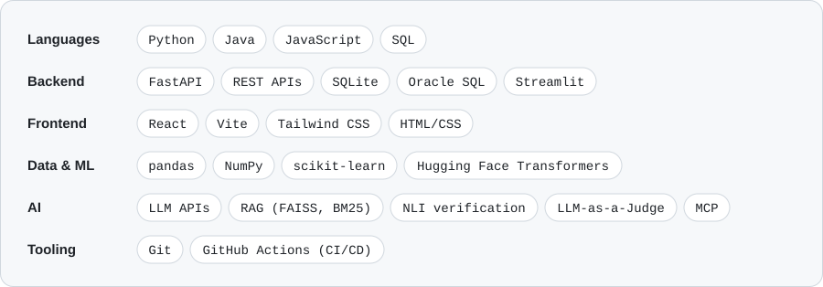
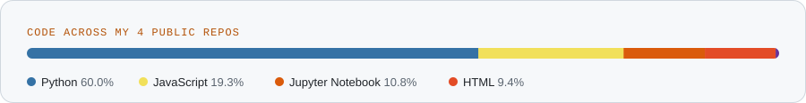

<picture>
  <source media="(prefers-color-scheme: dark)" srcset="assets/header-dark.svg">
  
</picture>

  
  
  
  

Computer Science undergraduate at Pranveer Singh Institute of Technology, Kanpur (B.Tech, 2024–2028).

A lot of what I build sits around AI agents and LLM applications — testing them, grounding them in real sources, and making their behaviour reproducible enough to rely on.

- **Studying:** B.Tech in Computer Science and Engineering, PSIT Kanpur (AKTU), graduating May 2028
- **Previously:** ML engineering intern at FlyRank (Jul – Aug 2026)
- **Interested in:** backend engineering, LLM applications, and evaluating AI systems

## Projects

<a href="https://github.com/Ujjawal030206/agent-reliability-engine"><picture><source media="(prefers-color-scheme: dark)" srcset="assets/card-agent-reliability-engine-dark.svg"></picture></a>
<a href="https://github.com/Ujjawal030206/civicai"><picture><source media="(prefers-color-scheme: dark)" srcset="assets/card-civicai-dark.svg"></picture></a>
<a href="https://github.com/Ujjawal030206/pramaan"><picture><source media="(prefers-color-scheme: dark)" srcset="assets/card-pramaan-dark.svg"></picture></a>
<a href="https://github.com/Ujjawal030206/Flyrank-ML-Internship"><picture><source media="(prefers-color-scheme: dark)" srcset="assets/card-flyrank-dark.svg"></picture></a>

**Try them live:** [Agent Reliability Engine](https://agent-reliability-engine.onrender.com/) · [CivicAI](https://ujjawal030206.github.io/civicai/) · [PRAMAAN](https://pramaan-baxpmqclpervayewtqet9s.streamlit.app/)

## Tech stack

<picture>
  <source media="(prefers-color-scheme: dark)" srcset="assets/stack-dark.svg">
  
</picture>

<picture>
  <source media="(prefers-color-scheme: dark)" srcset="assets/languages-dark.svg">
  
</picture>

## Experience

**ML Engineering Intern · FlyRank** — *Jul – Aug 2026*

- Analysed a 30,000-row production content dataset to find feature-decline signals for an SEO refresh-scoring engine, translating business requirements into measurable model inputs.
- Evaluated 3 ranking models against the existing rules engine on ROC AUC and Precision@k, and recommended the model taken forward.
- Replaced manual steps with reproducible data-prep and feature-engineering pipelines in version-controlled notebooks.

## Achievements

- **Hack Hatch 2025, IIIT Delhi** — top 100 of 2,500+ participants (about the top 4%)
- **Hackwise 2026, IIM Indore** — national finalist
- **HackerRank** — 4-star rating in Java (data structures and algorithms)
- **Certifications** — DSA with Java · Generative AI (Google Cloud) · AI Fluency: Framework & Foundations (Anthropic)

---

Best way to reach me is <a href="mailto:ujjawalsri030206@gmail.com">email</a> or <a href="https://www.linkedin.com/in/ujjawal-srivastava-03271a30b/">LinkedIn</a>.

